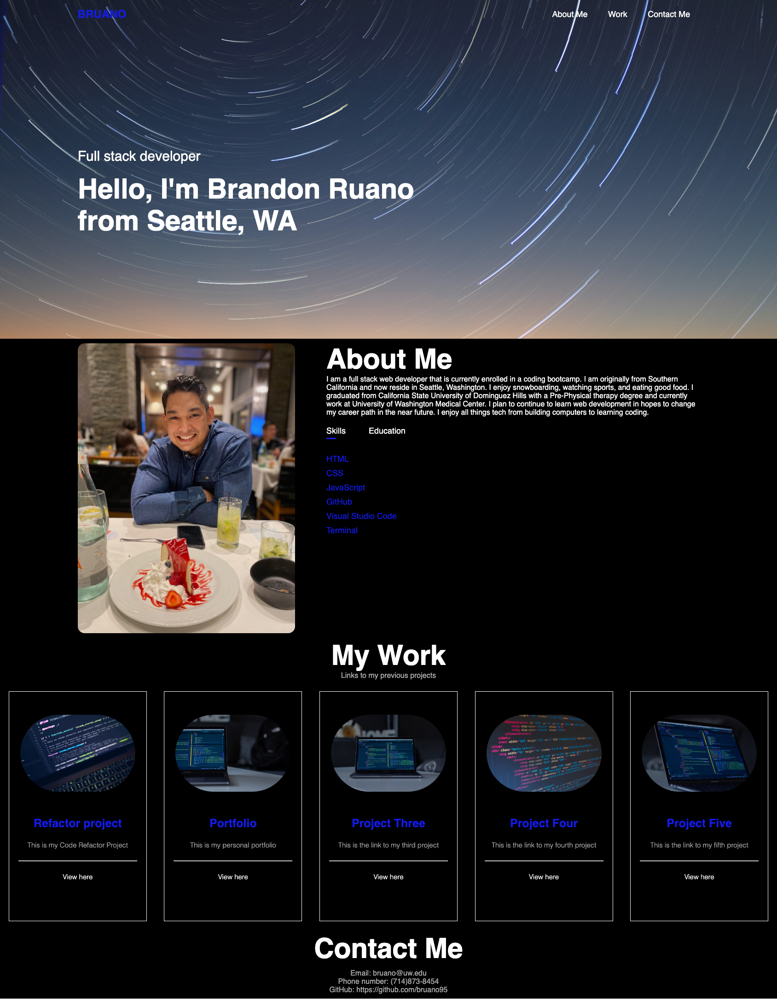

# Brandon Ruano's Portfolio
Creating a portfolio that highlights my strongest work and the creative processes behind it.

#Description

This website uses correct sematics within HTML as well as proper CSS layout to provide a prompt portfolio that can be used to show to future employers. Media queries are used within the CSS to provide correct and resposive changes for all screen sizes. Although not needed for the project, JavaScript was used within the ABOUT-ME section to provide furthur knowledge and skills. The website is used to show skills and knowledge of building a website from scratch.

Link to the project: https://bruano95.github.io/Brandon-Ruano-Portfolio/

#Getting Started

##Dependencies

In order to access this web page a working device that has access to the internet and a proper web browser is necessary.

##Installing

If the items listed above are available, there are no additional installations needed to access this project.

#Help

If the project/ web page is not running properly, please contact me through the ways listed below.

#Authors

Brandon Ruano
bruano@uw.edu
github.com/bruano95

#Acknowledgments

Images used within the project to act as placeholders came from: https://unsplash.com/s/photos/coding